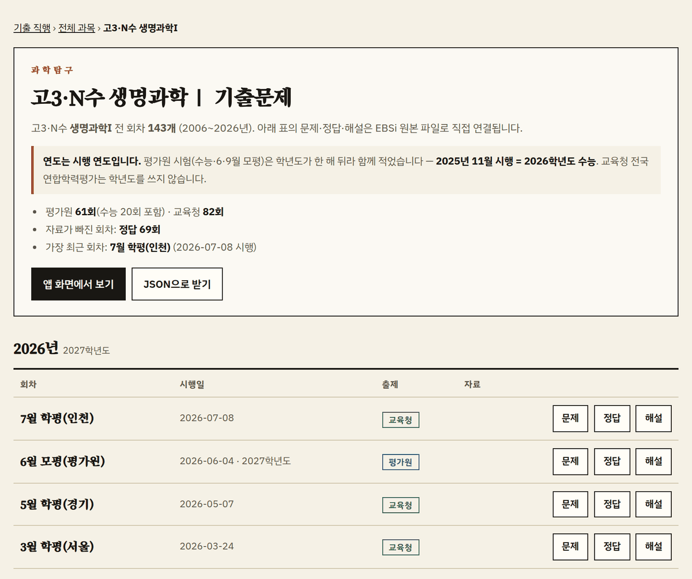
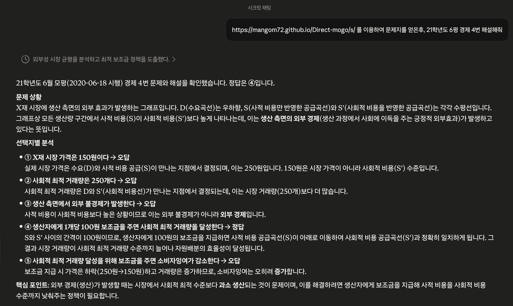

# 기출 직행

수능·모의평가·전국연합학력평가 **원본 PDF로 한 번에 이동하는** 페이지입니다.
EBSi에서 찾아 들어갈 필요 없이 학년 → 과목 → 연도만 고르면 문제·정답·해설이 바로 나옵니다.

**웹 → [mangom72.github.io/Direct-mogo](https://mangom72.github.io/Direct-mogo/)**
· **안드로이드 → [앱 받기](https://github.com/Mangom72/Direct-mogo/releases/latest/download/gijul-direct.apk)**


2006년 시행분부터 **5,059회차 · 77과목** — 국어·수학·영어·한국사, 사회·과학탐구에
**직업탐구와 제2외국어·한문**까지. 설치도 로그인도 없습니다.

## 할 수 있는 것

- **내 과목** — 자주 보는 과목을 ★로 저장해 한 줄 버튼으로. 길게 눌러 순서 변경, 링크로 다른 기기에 옮기기
- **보내기** — PDF를 받아 공유 시트로 넘깁니다. 홈 화면 앱에서도 노트앱으로 바로 보낼 수 있습니다
- **오프라인 저장** — 회차의 문제·정답·해설을 한 번에 내려받아, 연결이 없어도 파일 앱에서 엽니다
- **오프라인** — 한 번 열어두면 지하철·비행기에서도 조회·필터가 그대로 동작합니다
- **푼 회차 표시** — 회차 이름 옆 ✓를 눌러 손으로 찍습니다. 푼 날이 함께 남고(도장을 길게 눌러 고칩니다), 연도마다 진도가 차며, **안 푼 것만** 걸러 볼 수 있습니다. 홀수형·짝수형은 같은 시험지라 한 회차로 셉니다
- **홈 화면 위젯 여섯** — 달력 · 이번 주 · 잔디밭 · 최근 푼 것 · D-day와 진도 · 다음에 풀 것. 고르는 화면에 미리보기가 뜨고, 누르면 그 위젯이 말하던 자리로 갑니다 — 푼 것을 보여 주던 넷은 달력으로, '다음에 풀 것'은 줄마다 그 과목으로
- **푼 날 달력** — 진도 옆 달력 단추를 누르면 열립니다. 과목을 가리지 않고 날짜로 되짚습니다. 태블릿은 오른쪽에, 폰은 아래에 그날 푼 것이 펼쳐집니다
- **다크 모드** — 자동 / 밝게 / 어둡게
- **주소로 공유** — `#/D300/158/2024/gov` 처럼 화면 그대로 북마크·공유
- **수능 D-day** — 표제 옆에 남은 날. 관례(11월 13~19일 목요일)로 셈하므로 해가 바뀌어도 저절로 다음 회차를 가리킵니다
- **등급컷·정답률** — 회차 이름에 점선이 그어진 것은 EBSi 풀서비스로 가는 길입니다. 등급컷과 문항별 정답률이 그쪽에 있습니다 (고3 2022년 3월 이후 회차)

## 과목별 목록

검색으로 바로 들어오셔도 되도록, 과목마다 전 회차를 한 장에 펼친 페이지가 따로
있습니다. 문제·정답·해설이 EBSi 원본으로 바로 걸려 있어 앱을 거치지 않아도 됩니다.



**→ [과목별 기출문제 목록](https://mangom72.github.io/Direct-mogo/s/)**

## 안드로이드 앱

문제지를 **앱 안에서 바로 읽고**, 회차를 통째로 담아 연결 없이 볼 수 있습니다.
스토어에 없어서 APK를 직접 받습니다 — 한 번 넣으면 새 판은 앱이 알아서 알려줍니다.

**→ [앱 받기](https://github.com/Mangom72/Direct-mogo/releases/latest/download/gijul-direct.apk)**

받은 자료가 어디에 쌓이는지, 뷰어와 자체 업데이트가 어떻게 도는지는
[docs/android.md](docs/android.md)에 있습니다.

## AI에게 맡기기

**이 주소 하나면 됩니다.**

```
https://mangom72.github.io/Direct-mogo/s/
```

건네고 물어보시면 됩니다. 스크립트 없이 그대로 읽히는 HTML이라 어떤 도구로 받아도
과목 목록이 보이고, 과목마다 회차·시행일·기관과 **문제·정답·해설의 절대 주소**가
본문에 적혀 있습니다. 아무것도 모르는 상태로 받아도 한 번에 원하는 회차까지 갑니다.

과목이 이미 정해져 있다면 그 과목 페이지를 바로 건네시는 편이 더 짧습니다 —
예: `…/Direct-mogo/s/D300/158.html`.

### 홈 주소 대신 `/s/`를 건네시는 이유

홈 주소를 그대로 건네시면, 읽는 쪽이 **이 화면은 자료를 압축해 품고 스크립트로
펼치므로 받아 간 HTML에는 목록이 들어 있지 않다**는 사실을 스스로 알아차리고 읽히는
사본으로 옮겨 가야 합니다. 그 판단이 서는 도구는 각주와 `noscript` 안내를 보고
넘어가지만, **추론 여력이 크지 않은 경량 모델은 그 단계에서 멈추거나 사이트 밖
검색으로 새어 나갈 수 있습니다.** `/s/`를 바로 건네시면 그 단계가 통째로 사라집니다.

연도 규칙도 `/s/` 안에 적혀 있습니다 — **시행 연도와 학년도가 한 해 어긋난다**는
말이 과목 페이지마다 본문에 있어, 따로 일러 주지 않아도 "21학년도 6평"을 2020년 6월
시행분으로 옳게 옮깁니다. 아래 예가 그것입니다.

범위를 한 줄로 못박아 두면 결과가 눈에 띄게 안정적입니다.

```
이 사이트 외의 수단으로 검색하지 마세요.
```

이 한 줄이 없으면 웹 검색으로 새어 나가, 이 사이트와 무관한 문서를 근거로 답하는
일이 생깁니다.

### 이렇게 쓸 수 있습니다

주소를 건네고 **문제 풀이까지** 이어서 시킬 수 있습니다. 링크만 받아 오는 데서
끝나지 않고, 그 자리에서 문제지를 열어 읽습니다.

> https://mangom72.github.io/Direct-mogo/s/ 를 이용하여 문제지를 얻은후,
> 21학년도 6평 경제 4번 해설해줘



"21학년도"를 **2020년 6월 18일 시행분**으로 옳게 옮겼습니다 — 시행 연도로 찾았다면
한 해 어긋난 시험지를 폈을 것입니다. 정답 ④도 EBSi 정답표와 일치합니다.

### 프로그램으로 다루실 때

코드로 자료를 읽으신다면 `…/Direct-mogo/data/index.json`에서 시작하십시오. 학년·과목
목록과 각 과목 파일의 경로가 들어 있고, 과목 파일에는 회차마다 절대 주소와 `id` ·
`type` · `year` · `schoolYear`가 있습니다. 서버도 인증도 키도 필요 없는 정적 파일입니다.
같은 자리에 `llms.txt`(llmstxt.org 규격)도 있어, 도구가 그것을 먼저 집어 가더라도
길을 잃지 않습니다.

## 연도 표기

연도는 **시행 연도** 기준입니다. 평가원 시험의 학년도는 시행 연도 + 1이므로
(2013년 6월 시행 = 2014학년도 6월 모평) 화면에 학년도를 함께 표기합니다.
교육청 학력평가는 관례상 시행 연도로만 부릅니다.

## 출처와 저작권

- **코드** — 저장소가 직접 작성한 저작물은 **MIT 라이선스**에 따라 제공됩니다.
  원저작권 표시를 유지하는 범위에서 자유로이 복제·수정·배포할 수 있으며,
  별도의 사전 허락을 요하지 아니합니다. 전문은 [LICENSE](LICENSE)에 따릅니다.
- **문제 자료** — 저작권은 **한국교육과정평가원** 및 **각 시·도교육청**에
  귀속됩니다. 저장소는 문제 자료를 저장하거나 재배포하지 아니하며, 회차
  명칭·시행일·공개된 파일 주소 등 목록 정보만을 보유합니다. 모든 링크는
  EBSi가 공개하여 별도의 인증 없이 접근 가능한 주소로 직접 연결됩니다.
- **권리자의 요청** — 권리자 또는 정당한 대리인의 게시중단 요청은 확인 즉시
  이행하며, 해당 내용을 삭제하거나 저장소 전부를 비공개로 전환합니다. 요청은
  전자우편 <direct.mogo.dev@gmail.com> 또는
  [GitHub 이슈](https://github.com/Mangom72/Direct-mogo/issues)로 접수합니다.
- **글꼴** — `fonts/` 의 글꼴은 SIL Open Font License 1.1에 따릅니다.

이용 조건의 전문은 [NOTICE.md](NOTICE.md) 에 정리되어 있습니다.

---

이 저장소를 고치실 분은 [docs/build.md](docs/build.md)를 보세요 — 파일 구성, 자료
갱신 순서, 검색 노출 구조, 로컬 실행이 정리돼 있습니다.
