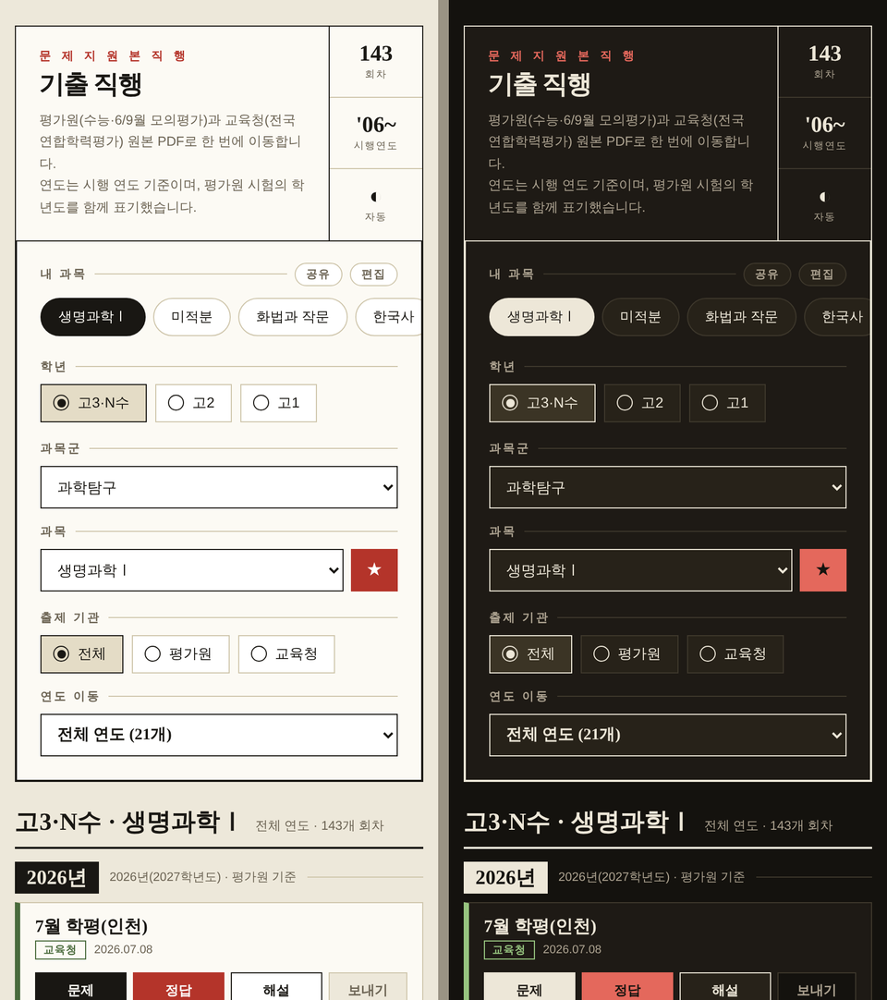

# 기출 직행

수능·모의평가·전국연합학력평가 **원본 PDF로 한 번에 이동하는** 페이지입니다.
EBSi를 헤매지 않고 학년 → 과목 → 연도만 고르면 문제·정답·해설이 바로 나옵니다.

**→ [mangom72.github.io/Direct-mogo](https://mangom72.github.io/Direct-mogo/)**



2006년 시행분부터 **3,844회차 · 49과목**을 담고 있습니다.

## 할 수 있는 것

- **내 과목** — 자주 보는 과목을 ★로 저장해 한 줄 버튼으로. 꾹 눌러 순서 변경, 링크로 다른 기기에 옮기기
- **보내기** — PDF를 받아 공유 시트로 넘깁니다. 홈 화면 앱에서도 노트앱으로 바로 보낼 수 있습니다
- **오프라인** — 한 번 열어두면 지하철·비행기에서도 조회·필터가 그대로 동작합니다
- **다크 모드** — 자동 / 밝게 / 어둡게
- **주소로 공유** — `#/D300/158/2024/gov` 처럼 화면 그대로 북마크·공유

## 어떻게 동작하나

빌드 도구도 서버도 없습니다. GitHub Pages에 정적 파일만 올라갑니다.

| 파일 | 역할 |
|---|---|
| `index.html` | 앱 전체. 자료 3,844회차가 gzip+base64로 안에 들어 있습니다 (154KB) |
| `sw.js` | 서비스 워커. 앱 셸·폰트·받아둔 PDF를 캐시합니다 |
| `data/`, `llms.txt` | AI·프로그램용 정적 JSON과 사용 안내 |
| `tools/refresh_data.py` | EBSi에서 새 회차를 긁어 페이로드를 갱신합니다 |
| `tools/build_api.py` | 페이로드를 `data/` JSON과 `llms.txt`로 내보냅니다 |
| `mcp/gijul_server.py` | Claude에 도구로 붙이는 MCP 서버 |
| `.github/workflows/refresh-data.yml` | 매월 5일 자동 실행 |

자료를 `index.html` 안에 넣어둔 덕분에, **이 파일 하나만 캐시하면 조회·필터가 네트워크 없이 전부 동작합니다.** 네트워크가 필요한 건 PDF를 받을 때뿐입니다.

PDF는 EBSi가 `Access-Control-Allow-Origin: *`를 주기 때문에 페이지가 직접 받아
`navigator.share()`로 넘길 수 있습니다. 그래서 설치형 앱에서도 노트앱으로 보내집니다.

## AI·프로그램에서 쓰기

화면용 HTML은 자료가 압축돼 있어 AI가 읽어도 소용없습니다. 같은 자료를
**정적 JSON으로도 함께 배포**합니다. 서버도 인증도 키도 필요 없습니다.

```
https://mangom72.github.io/Direct-mogo/llms.txt          AI용 사용 안내
https://mangom72.github.io/Direct-mogo/data/index.json   과목 목록과 각 과목 JSON 주소
https://mangom72.github.io/Direct-mogo/data/D300/158.json 고3 생명과학Ⅰ 전 회차
```

과목 하나가 평균 26KB라 필요한 과목만 받아 가면 됩니다. 각 회차에 문제·정답·해설
**절대 주소**가 들어 있어 경로 규칙을 몰라도 바로 열립니다.

아무 AI에게든 `llms.txt` 주소를 주면 나머지는 알아서 합니다.

### Claude에 도구로 붙이기 (MCP)

`mcp/gijul_server.py`가 위 JSON을 읽어 Claude에 도구로 노출합니다 —
`list_subjects`, `find_papers`, `site_info`.

```bash
pip install "mcp[cli]" httpx

# Claude Code
claude mcp add 기출직행 -- python3 "$PWD/mcp/gijul_server.py"
```

Claude Desktop은 `claude_desktop_config.json`에:

```json
{ "mcpServers": {
    "기출직행": { "command": "python3", "args": ["/절대/경로/mcp/gijul_server.py"] }
} }
```

붙이고 나면 이렇게 물으면 됩니다 — *"2026학년도 수능 생명과학Ⅰ 문제 찾아줘"*.
배포된 JSON을 읽으므로 저장소를 클론하지 않아도 되고, 월간 갱신도 그대로 따라옵니다.

## 자료 갱신

새 회차는 워크플로가 알아서 채웁니다. 직접 돌리려면:

```bash
pip install requests
python3 tools/refresh_data.py --dry-run   # 무엇이 늘어나는지만 확인
python3 tools/refresh_data.py             # index.html 갱신
```

기존 기록은 고치지 않고 **아직 없는 시행일만 덧붙입니다.** 수집량이 기존의 80%에
못 미치면 EBSi 구조가 바뀐 것으로 보고 파일을 건드리지 않은 채 실패합니다.

## 로컬에서 보기

```bash
python3 -m http.server 8000
```

서비스 워커는 `localhost`에서도 동작합니다. 캐시 때문에 변경이 안 보이면
개발자도구 → Application → Service Workers에서 Unregister 하세요.

## 출처와 저작권

모든 링크는 **EBSi가 공개 제공하는 파일 주소로 직접 연결**되며(로그인 불필요),
이 저장소는 어떤 파일도 저장하거나 재배포하지 않습니다.
문제지 저작권은 **한국교육과정평가원** 및 **각 시·도교육청**에 있습니다.

연도는 **시행 연도** 기준입니다. 평가원 시험의 학년도는 시행 연도 + 1이므로
(2013년 시행 = 2014학년도 6월 모평) 화면에 학년도를 함께 표기합니다.
